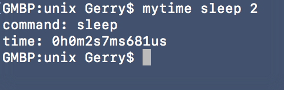
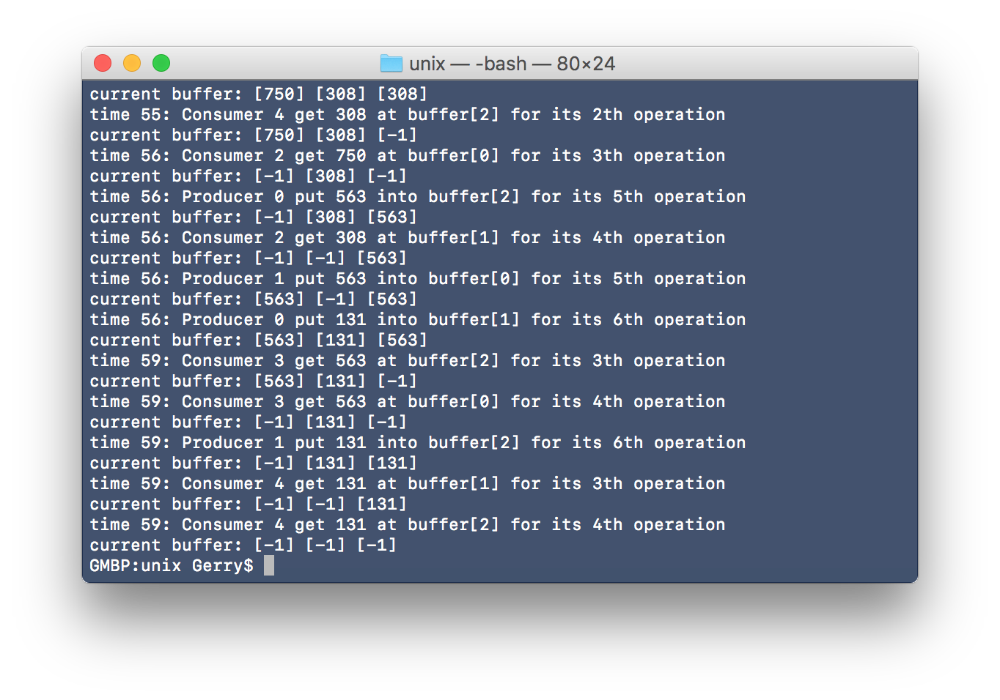
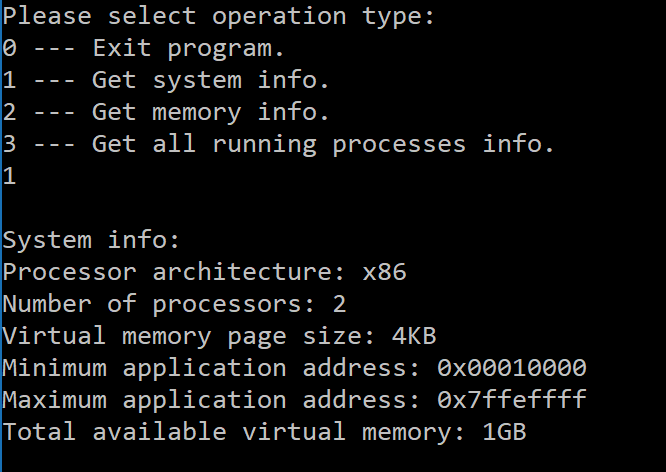
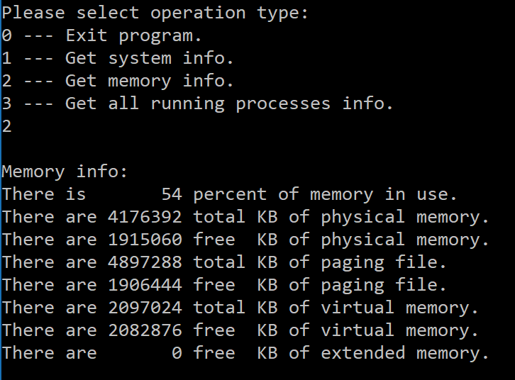
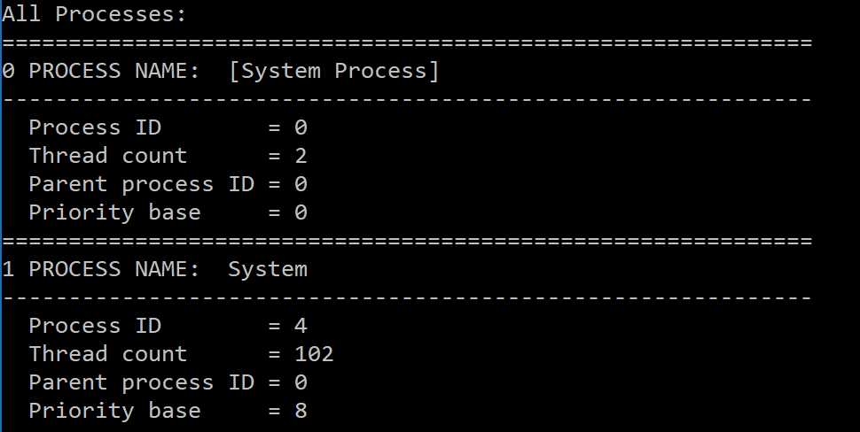
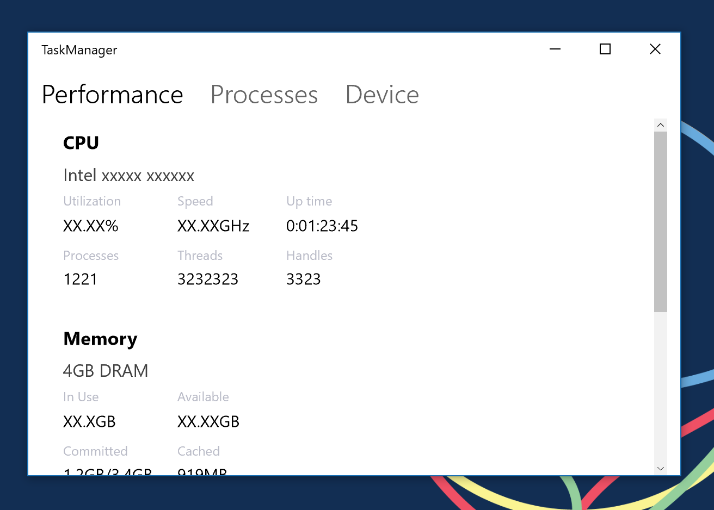
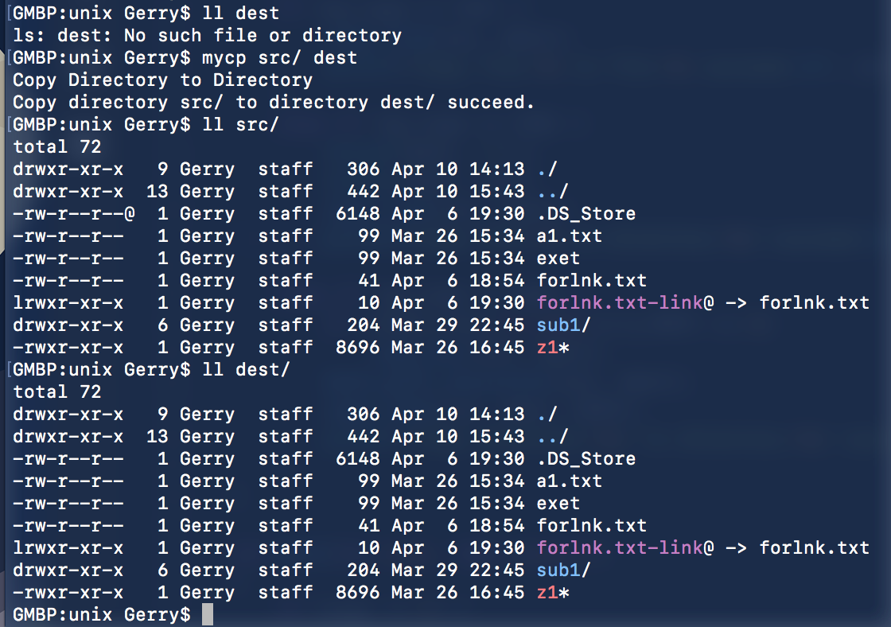

# OS-Practice
Operating System Practice course projects.

## Practice 1: Compile Kernel

```shell
wget https://cdn.kernel.org/pub/linux/kernel/v4.x/linux -4.4.52.tar.xz
sudo tar -xvf linux-4.4.52.tar.xz
sudo cp /boot/config-`uname -r` .config
sudo make -jX (X is the number of processors)
sudo make modules_install install
sudo vim /etc/default/grub
sudo update-grub
```
### Effect:


## Practice 2: Process control

Implement time command.

```c
if ((pid = fork()) < 0) {
        printf("Fork error!\n");
} else if (pid == 0) {
    printf("command: %s\n", argv[1]);
    if (execvp(argv[1], argv+1) < 0)
    	printf("Execut cmd error.\n");
        exit(1);
    }
} else {
    if (wait(NULL) < 0) {
    	printf("Wait child cmd error.\n");
    }
}
```

### Effect




## Practice 3: Producer-Consumer problem

Implement Producer-Consumer problem with **processes.**

### Effect



## Practice 4: Memory Monitor

### Win32

Call winapi implement a memory monitor.

#### Effect








### UWP

* [ ] Working on ...

#### Effect




## Practice 5: Copy files

Implement cp command

### Effect




## Final Project

Do whatever you want to, but must be related to Operating System.

* [ ] Working on ...

## Copyright

You can do anything 🤓.